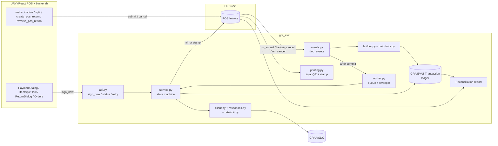
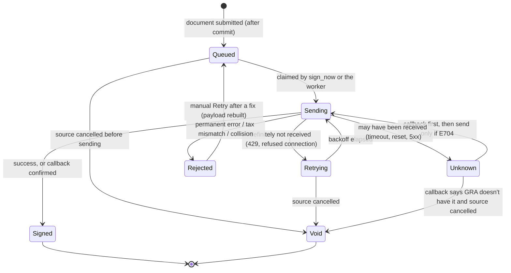

# 06 — `gra_evat` app design

A standalone Frappe app that signs ERPNext sales documents with GRA's E-VAT
system, plus a thin layer of URY glue. **Design only — nothing is built.**
Items marked **(Dn)** depend on an open decision in
[08-decisions-and-risks.md](08-decisions-and-risks.md).

---

## 1. Principles

1. **URY's books and GRA's record must match to the cent**, and we must be able
   to prove it. GRA's validator only checks to ±0.50, so the proof comes from
   our own ledger.
2. **Send URY's booked figures verbatim.** Never recompute the tax differently
   from what was booked. A separate calculator checks the booked figures and
   holds anything that looks wrong.
3. **Never call GRA before the database commits.** A sale GRA signed but URY
   rolled back is an unfixable mismatch.
4. **Never lose a stamp, never sign twice.** Every uncertain outcome is resolved
   with a callback before any resend.
5. **Trading doesn't stop because GRA is slow or down** (D2). Unsigned sales
   are queued, clearly marked, and signed as soon as GRA is reachable.
6. **Refuse bad input locally.** Anything GRA is known to reject fails with a
   clear message before it's sent.
7. **Generic core, thin URY glue.** `gra_evat` knows ERPNext (POS Invoice, Item,
   Customer), not restaurants. It works for URY, for ERPNext's own POS, and for
   future Ghana deployments.
8. **Configuration, not guesswork.** Which tax account is NHIL, which branch
   uses which key, and which categories an item has are all configured
   explicitly. Anything unmapped is refused.

## 2. Architecture



### 2.1 Where the code lives

- **`gra_evat`** — a new app, its own git repository (D11), installed with
  `bench get-app`. Requires `frappe` and `erpnext` (v16). Does **not** require
  `ury`.
- **URY glue** — small changes inside the URY repo (Phase 3): the
  `cancel_order` guard, calling `sign_now` from the POS, status badges, a TIN
  input, and a flag in `getPosProfile`. URY checks
  `"gra_evat" in frappe.get_installed_apps()` so it still works without it.

### 2.2 Module layout

```
gra_evat/
├── pyproject.toml                     # no new dependencies: requests, PyQRCode, pypng ship with frappe
└── gra_evat/
    ├── hooks.py                       # doc_events, scheduler, jinja methods, after_install/after_migrate
    ├── install.py                     # custom fields, DB unique index, defaults
    ├── setup/custom_fields.py         # THE single source of custom fields
    ├── api.py                         # whitelisted endpoints (§12)
    ├── evat/
    │   ├── calculator.py              # pure tax maths (spec: 02 §8)
    │   ├── builder.py                 # ERPNext doc -> payload (§6)
    │   ├── responses.py               # envelope parser + classifier (03 §1, §3)
    │   ├── client.py                  # HTTP transport (§7)
    │   ├── ratelimit.py               # Redis token bucket per key
    │   ├── config.py                  # resolve branch config, environment guard (§10)
    │   ├── service.py                 # state machine: queue / send / callback / void (§4)
    │   ├── events.py                  # POS Invoice doc_event handlers (§5)
    │   ├── worker.py                  # queue runner + sweeper (§5.6)
    │   └── printing.py                # jinja: QR, stamp, receipt state (§8)
    ├── gra_evat/                      # Frappe module "GRA EVAT"
    │   ├── doctype/
    │   │   ├── gra_evat_settings/         # Single
    │   │   ├── gra_evat_tax_account/      # child of Settings
    │   │   ├── gra_evat_branch/           # per-branch credentials
    │   │   ├── gra_evat_transaction/      # the ledger
    │   │   └── gra_evat_attempt/          # child of Transaction
    │   ├── report/gra_evat_reconciliation/
    │   ├── print_format/gra_evat_pos_receipt/
    │   └── workspace/gra_evat/
    ├── templates/includes/gra_evat_receipt_block.html
    └── tests/                         # see 07 §4
```

## 3. Doctypes

### 3.1 `GRA EVAT Settings` (Single)

| Field | Type | Default | Purpose |
|---|---|---|---|
| `enabled` | Check | 0 | Master switch |
| `environment` | Select `Staging` / `Production` | Staging | Production also needs the site-config guard (§10) |
| `sync_timeout` | Int (s) | 8 | Wait at payment before printing a provisional receipt |
| `background_timeout` | Int (s) | 30 | Worker timeout |
| `max_attempts` | Int | 20 | Automatic attempts before `Rejected` |
| `rate_limit_per_minute` | Int | 45 | Per key; GRA's limit is 50 |
| `unsigned_sale_policy` | Select `Allow sale, sign later` / `Block sale` | Allow (D2) | What happens when a sale can't be signed |
| `block_cancel_of_signed` | Check | 1 (D3) | `before_cancel` guard |
| `tax_mismatch_threshold` | Currency | 0.05 | Booked vs calculated tax |
| `tax_mismatch_policy` | Select `Hold` / `Send and flag` | Hold | |
| `b2c_partner_name` | Data | `Cash Customer` (D8) | Name sent for walk-in customers |
| `b2c_partner_tin` | Data | `C0000000000` (D8) | TIN sent when the customer has none |
| `walk_in_customers` | Table MultiSelect → Customer | — | Customers always sent as B2C (a POS Profile's default customer is always included) |
| `provisional_text` | Small Text | "PROVISIONAL — E-VAT signature pending. NOT A VAT INVOICE." | Printed on unsigned paid receipts |
| `bill_text` | Small Text | "BILL — NOT A VAT INVOICE" | Printed on unpaid bills |
| `alert_role` | Link → Role | System Manager | Who is alerted |
| `tax_accounts` | Table → `GRA EVAT Tax Account` | — | §3.2 |

### 3.2 `GRA EVAT Tax Account` (child)

| Field | Type | Notes |
|---|---|---|
| `company` | Link → Company | |
| `account` | Link → Account | a tax account used on sales tax rows |
| `bucket` | Select `NHIL` / `GETFUND` / `COVID` / `CST` / `TOURISM` / `VAT` / `EXCISE` | what GRA calls it |

Every tax row on an invoice must map to exactly one bucket, or the invoice is
refused with "Tax account X is not mapped for GRA E-VAT".

### 3.3 `GRA EVAT Branch` (one per branch; name = branch)

| Field | Type | Notes |
|---|---|---|
| `branch` | Link → Branch, unique | URY stores `branch` on every POS Invoice |
| `company` | Link → Company | |
| `is_company_default` | Check | used when an invoice has no branch (non-URY POS) |
| `enabled` | Check | |
| `company_reference` | Data | `{TIN}-{3-digit branch code}`, validated |
| `tin` | Data, read-only | derived from the reference |
| `security_key` | **Password** | stored encrypted; never exported or logged |
| `deployment` | Select `Cloud` / `On-Prem` | |
| `host_url` | Data | defaults to the staging URL in Staging; required in Production. `https://` only, except On-Prem may use `http://` on a private address |
| `go_live_date` | Date, required | invoices dated earlier are never signed |
| `invoice_number_prefix` | Data | optional; protects against re-issued numbers after a site rebuild (D14) |
| `allowed_categories` | Small Text | categories enabled for this taxpayer at GRA (default: standard, `EXM`) — an item with any other category is refused locally |
| `health` | Select `Unknown` / `Healthy` / `Unhealthy`, read-only | |
| `last_success_at`, `last_error` | read-only | |

Buttons: **Test connection** (`/health`), **Look up TIN**.

### 3.4 `GRA EVAT Transaction` (the ledger; `EVAT-.YYYY.-.######`)

One row per fiscal document. Retries update the same row. Users can read it;
only the system writes it.

| Group | Fields |
|---|---|
| Source | `reference_doctype`, `reference_name` (Dynamic Link), `company`, `branch`, `gra_branch` |
| Type | `transaction_type` (`INVOICE` / `REFUND` / `PARTIAL_REFUND` / `REFUND_CANCELATION`), `original_transaction` (Link → self: the sale for a refund, the refund for a cancellation) |
| Identity | `gra_invoice_number`, `gra_reference`, `transaction_date` |
| State | `status` (§4), `error_class`, `error_code`, `error_message`, `http_status`, `attempts`, `next_attempt_at`, `last_attempt_at`, `sending_since` |
| As sent | `calculation_type`, `currency`, `exchange_rate`, `total_amount`, `discount_amount`, `nhil`, `getfund`, `covid`, `cst`, `tourism`, `total_levy`, `total_vat`, `total_excise`, `line_count` |
| Check | `calc_total_levy`, `calc_total_vat`, `tax_difference` (booked − calculated) |
| Payloads | `request_payload` (JSON), `response_payload` (JSON) |
| Stamp | `sdc_id`, `receipt_number`, `internal_data`, `signature`, `mrc`, `mrc_time`, `stamp_time`, `item_count`, `qr_code`, `signed_at` |
| History | `attempt_log` (Table → `GRA EVAT Attempt`: `at`, `kind` send/callback, `http_status`, `code`, `message`, `duration_ms`) |

**Unique index** on (`gra_branch`, `transaction_type`, `gra_invoice_number`,
`gra_reference`), created in `install.py`, so a hook that runs twice can never
create two ledger rows for one document.

List actions (managers): **Retry**, **Check with GRA** (callback), **Void**
(only when GRA is confirmed not to have it).

### 3.5 Custom fields — one source, `setup/custom_fields.py`

Created on `after_install` **and** `after_migrate` with `create_custom_fields`.
No fixtures — URY's two-source drift problem doesn't get a chance to happen.

| DocType | Field | Type | Notes |
|---|---|---|---|
| Item | `gra_evat_category` | Select `` / `EXM` / `CST` / `TRSM` / `RNT` / `EXC_PLASTIC` | default standard |
| POS Invoice | `gra_evat_section` | Section Break (collapsible) | "GRA E-VAT" |
| POS Invoice | `gra_evat_status` | Select `Not Applicable` / `Queued` / `Sending` / `Signed` / `Retrying` / `Unknown` / `Rejected` / `Void` | read-only, `allow_on_submit`, **`no_copy`**, standard filter |
| POS Invoice | `gra_evat_transaction` | Link → GRA EVAT Transaction | read-only, `no_copy` |
| POS Invoice | `gra_evat_receipt_number`, `gra_evat_sdc_id`, `gra_evat_internal_data`, `gra_evat_signature`, `gra_evat_mrc`, `gra_evat_stamp_time`, `gra_evat_item_count`, `gra_evat_qr_code` | Data / Small Text | read-only, `allow_on_submit`, **`no_copy`** — mirrored from the ledger so any print format can render them |

`no_copy` matters: ERPNext's `make_return_doc` copies fields, and a return must
**not** inherit its sale's stamp.

The customer's TIN is ERPNext's existing **`Customer.tax_id`**.

## 4. The transaction state machine



| Status | Meaning | Does GRA have it? |
|---|---|---|
| `Queued` | built, waiting | no |
| `Sending` | an attempt is in flight (`sending_since` set) | maybe |
| `Signed` | stamp stored | **yes** |
| `Retrying` | failed before GRA processed it | **no** |
| `Unknown` | failed in a way GRA *may* have processed it | **maybe** — resolve with a callback |
| `Rejected` | GRA refused, or refused locally; needs a human | no |
| `Void` | source cancelled while GRA definitely didn't have it | no |

**Claiming a row** is an atomic compare-and-set, so the payment-time call and
the worker can never both send:

```sql
UPDATE `tabGRA EVAT Transaction`
   SET status = 'Sending', sending_since = NOW()
 WHERE name = %s AND status IN ('Queued', 'Retrying', 'Unknown')
```
One row updated → this caller owns the attempt. Zero → someone else does. The
`Sending` state is committed **before** calling GRA and the result is
committed **after**. A `Sending` row older than 2 minutes (crashed worker) is
moved to `Unknown` by the sweeper.

Even if two sends slipped through, GRA answers the second with E700 and the
callback returns the same stamp — so there is still exactly one signed sale.

## 5. Flows

### 5.1 Sale

```mermaid
sequenceDiagram
  participant POS as URY POS
  participant U as URY make_invoice
  participant E as gra_evat events
  participant T as Ledger
  participant S as gra_evat service
  participant G as GRA VSDC

  POS->>U: pay
  U->>E: invoice.submit() → on_submit
  E->>E: applicable? build payload, check tax
  E->>T: insert Transaction (Queued, payload)
  E-->>E: after_commit: enqueue job
  U-->>POS: paid (committed)
  POS->>S: sign_now(invoice), wait ≤ 8 s
  S->>T: claim (CAS → Sending), commit
  S->>G: POST /invoice
  G-->>S: stamp
  S->>T: Signed + stamp, commit
  S->>U: mirror stamp onto POS Invoice
  S-->>POS: Signed + stamp
  POS->>POS: print fiscal receipt (QR)
  Note over POS,S: If not signed within 8 s: print a PROVISIONAL receipt,<br/>show "E-VAT pending"; the worker keeps going.
```

`on_submit` decides applicability first. **Not applicable** (status set, no
ledger row) when: the app or the invoice's branch is disabled; the posting
date is before the branch's `go_live_date`; or nothing taxable remains after
§6.1. (Consolidated Sales Invoices are a different DocType and are never
hooked.)

Then it **builds the payload inside the submit transaction**, freezing the
exact figures, names and categories at the moment of sale. If building fails
(unmapped tax account, tax mismatch, invalid TIN, …):

| `unsigned_sale_policy` | Result |
|---|---|
| **Allow sale, sign later** (proposed) | The sale completes. The ledger row is `Rejected` with the reason, an alert goes out, and the receipt prints as provisional. |
| **Block sale** | `frappe.throw` — the payment fails with the reason. |

### 5.2 Return

`on_submit` with `is_return = 1`:
1. Find the original sale's `INVOICE` transaction (via `return_against`).
   - None (sale predates go-live or was not applicable) → **Not applicable**:
     GRA never saw the sale, so a refund would fail with E704.
   - Original `Void` → return is not applicable.
2. Choose `REFUND` or `PARTIAL_REFUND` ([05 §5](05-ury-integration-analysis.md#5-choosing-the-flag-for-a-return)).
3. Build lines from the **original's stored payload** (same codes, unit prices
   and categories), with quantities and levies from the return document
   (absolute values).
4. `invoiceNumber` = the sale's GRA number; `reference` = the return's own GRA
   number.
5. Insert as `Queued`, `original_transaction` = the sale. **The worker won't
   send it until the sale is `Signed`.**

### 5.3 Undo return

`on_cancel` of a return document:

| Refund transaction is… | Action |
|---|---|
| `Signed` | create a `REFUND_CANCELATION` transaction (Queued) |
| `Queued` / `Retrying` | void the refund; nothing to cancel at GRA |
| `Unknown` / `Sending` | create the cancellation anyway, depending on the refund; the worker resolves the refund by callback first, then either sends the cancellation or voids both |
| `Rejected` | void the refund |

### 5.4 Cancelling a sale

`before_cancel` on a sale (`is_return = 0`), when `block_cancel_of_signed` is on (D3):

| Sale transaction is… | Result |
|---|---|
| `Signed`, `Sending`, `Unknown` | **refused**: "This sale is recorded with GRA. Reverse it with a Return." (`Unknown` also triggers an immediate check) |
| `Queued`, `Retrying` | allowed; the transaction is voided with a compare-and-set. If a worker claimed it in the meantime, the cancel is refused with "being sent to GRA right now, try again". |
| `Rejected` | allowed; voided |

URY's `cancel_order` bypasses hooks entirely, so URY itself must refuse paid
invoices ([05 §3.1](05-ury-integration-analysis.md#31-cancel_order-can-cancel-a-paid-invoice-silently--must-fix-before-go-live)).

### 5.5 Sending (shared by `sign_now` and the worker)

1. Claim the row (§4). Check the environment guard (§10) and the rate limit.
2. If `Unknown`: **callback first**. Stamp → verify → `Signed`. `E704` → go to 3.
3. `POST` the stored payload.
4. Classify the outcome ([03 §3](03-errors-and-responses.md#3-how-gra_evat-reacts)).
   `ALREADY_DONE` → callback → verify → `Signed`.
5. Write the result and an attempt-log row; mirror the stamp onto the source
   document; commit.
6. A `CONFIG` failure marks the branch `Unhealthy` and pauses its queue
   (health re-checked every 5 minutes).

**Verifying a callback stamp**: `num` and `flag` must match what we sent, and
`ysdcitems` must equal our distinct line count. Otherwise → `Rejected`
("invoice number collision").

### 5.6 Worker and sweeper

| Job | When | Does |
|---|---|---|
| immediate send | after commit of each new transaction (`enqueue_after_commit`, job id = transaction name) | §5.5 |
| `process_queue` | every minute | sends due `Queued` / `Retrying` / `Unknown` rows, oldest first, per branch, within the rate budget; skips rows whose `original_transaction` isn't settled |
| `sweep` | every 15 minutes | stale `Sending` → `Unknown`; **creates missing transactions** for submitted POS Invoices since go-live that have none (catches any bypassed hook); raises alerts |
| `health` | every 5 minutes | `/health` for `Unhealthy` branches |

Alerts go to `alert_role` for: any `Rejected`; a branch turning `Unhealthy`;
`Retrying` older than an hour; `Unknown` older than 15 minutes.

## 6. Payload builder

Input: a submitted POS Invoice. Output: a payload dict plus the figures stored
on the ledger.

### 6.1 Lines
1. For each item row: resolve the category (`Item.gra_evat_category`) and the
   GRA item code (§6.2).
2. **Unit price** on the calculation basis: `price_list_rate` if it is set,
   otherwise `rate`.
3. **Line discount** is derived from what was actually booked, so it can
   never disagree with the booked tax:
   - inclusive: `unitPrice × qty − (net_amount + line taxes)`
   - exclusive: `unitPrice × qty − net_amount`

   Tiny negative rounding residues are clamped to 0.
4. **Line levies** are summed from `item_wise_tax_details` rows where
   `item_row` is this row, bucketed by the tax row's account mapping.
5. **Aggregate** rows that share a GRA item code: add quantities, discounts
   and levies. If their unit prices differ, merge them at the quantity-weighted
   average price (Σ price × qty ÷ Σ qty), which keeps `totalAmount` unchanged
   and avoids E827. *(Phase 1 must confirm GRA accepts the resulting decimal
   precision; the fallback is to split into `CODE` and `CODE~2`.)*
6. Drop a line whose unit price is 0 (GRA rejects it). A comped item with a
   list price is sent as a 100 % discount, which GRA accepts. If nothing
   taxable remains, the document is **Not Applicable**.

### 6.2 GRA item code
- Standard category → the ERPNext `item_code`.
- Other categories → `item_code` + `~` + category (e.g. `WATER~EXM`). Changing
  an item's category then produces a new code automatically, so GRA's
  permanent category memory (E806) never bites.
- Longer than 50 characters (the documented limit) → the first 41 characters
  + `~` + 8 hex characters of a SHA-1 of the full code, then the category
  suffix. Deterministic, so the same item always gets the same code.
- `description` = `item_name`, trimmed to 100.

### 6.3 Header
As mapped in [05 §4](05-ury-integration-analysis.md#4-field-mapping--pos-invoice--gra-payload).
Totals come from the invoice's **tax rows** (URY's booked figures), bucketed by
account.

### 6.4 Local validation (refuse before sending)

| Check | Message |
|---|---|
| currency in the supported list | "Currency XYZ is not supported by GRA E-VAT" |
| exchange rate > 0 | |
| every tax row mapped | "Tax account X is not mapped" |
| all tax rows inclusive, or all exclusive | "Mixed inclusive/exclusive taxes can't be sent to GRA" |
| categories allowed for the branch | "Category RNT is not enabled for this branch at GRA" |
| one category per line | |
| quantity > 0, unit price > 0, total amount > 0 | |
| partner name 2–100 chars | |
| B2B TIN: 11 or 13 alphanumerics, or `GHA-#########-#` | "Customer TIN looks invalid" |
| invoice number ≤ 100 chars, no control characters | |
| date not in the future, not before 2026-01-01, not before go-live | |
| **tax check**: booked vs calculator within `tax_mismatch_threshold` | "Booked VAT 3.12 differs from the expected 2.63 — check that the tax template rows are *On Net Total*" |

### 6.5 Refunds and cancellations
- Refund lines come from the sale's stored payload (codes, unit prices,
  categories); quantities, discounts and levies from the return document.
- The refund's totals are the return's booked tax rows, as positive numbers.
- Cancellation payload: `invoiceNumber` (sale), `reference` (refund),
  `userName`, `flag`, `transactionDate` (now, ISO-8601), `totalAmount` (the
  refund's total).

## 7. HTTP client

- `requests`; headers `security_key` and `Content-Type: application/json`.
  **Headers are never logged**; `request_payload` never contains the key.
- The key is read with `get_password()` at send time.
- Timeouts: `sync_timeout` for `sign_now`, `background_timeout` otherwise.
- Every response goes through `responses.parse()`, which recognises all five
  shapes and returns
  `Outcome(kind, stamp, code, message, http_status, raw, may_have_been_received)`.
- `ratelimit.acquire(branch)` — a Redis counter per key and minute, shared by
  all workers. When no budget is left, the attempt is not made: `sign_now`
  returns "queued" and the worker waits.

## 8. Printing

### 8.1 Jinja helpers (registered through `hooks.jinja`)
- `gra_evat_stamp(doc)` → the receipt state (`bill` / `provisional` /
  `signed` / `not_applicable`), the stamp fields and the tax breakdown.
- `gra_evat_qr(url, size_mm=30)` → an `` holding a PNG data URI
  (PyQRCode + pypng, both already installed). Minimum printed size is 25 mm
  (GRA requires 2.5 cm).

### 8.2 The receipt block — `templates/includes/gra_evat_receipt_block.html`

| State | Printed |
|---|---|
| `bill` (unpaid draft) | **BILL — NOT A VAT INVOICE** |
| `provisional` (paid, not signed yet) | **PROVISIONAL — E-VAT signature pending. NOT A VAT INVOICE.** |
| `signed` | **EVAT RECEIPT INFORMATION** — SDC ID, Receipt Number, Internal Data, Signature, MRC, Date & Time, Line-Item Count, then the QR code |
| `not_applicable` | nothing |

Any print format can add it with one line:
```jinja

```
The client's existing bill format needs that one line (D9).

### 8.3 Reference print format — "GRA EVAT POS Receipt"
Follows GRA's POS sample ([reference/sample-receipt-pos.png](reference/sample-receipt-pos.png)):
taxpayer name and TIN · **VAT INVOICE** (or **VAT REFUND**) · customer and
customer TIN · invoice number · date · currency · items (description with
code, price, quantity, amount) · total excluding taxes · discount · NHIL ·
GETFund · CST / tourism when non-zero · VAT · total taxes · invoice total ·
the receipt block · served by. Whether the **GRA logo** must appear is D9.

### 8.4 Reprints
A reprint made to add a late stamp should not count against URY's cashier
reprint limit (D5).

## 9. Reconciliation

Report **GRA EVAT Reconciliation** (Script Report).

Filters: company, branch, from/to date, "Show" (all / differences only /
not signed only).

| Column | Source |
|---|---|
| Date, Document, Kind (Sale / Refund / Refund cancellation) | POS Invoice / ledger |
| URY: NHIL, GETFund, other levies, VAT, total tax | the document's booked tax rows |
| GRA: status, receipt number, NHIL, GETFund, other levies, VAT | ledger (signed rows only) |
| Difference | URY − GRA |

Signs: sales +, refunds −, refund cancellations +.

**URY net tax** = tax on submitted sales − tax on submitted (not cancelled)
returns.
**GRA net tax** = signed sales − signed refunds + signed refund cancellations.

These are equal exactly when every document is signed. The summary shows both
totals, the difference, counts by status, and **Missing** (submitted since
go-live with no ledger row). **Pass condition: difference 0.00 and nothing
unsigned or missing.**

An optional column compares against the consolidated Sales Invoices (the GL),
where ERPNext's known one-cent recomputation gap would show — separately from
the URY-to-GRA comparison.

## 10. Configuration and safety

- **Production guard.** With `environment = Production`, every send also needs
  `"gra_evat_allow_production": 1` in the site's `site_config.json`. A
  restored backup or a cloned dev site therefore **cannot** sign real
  invoices by accident.
- **Host sanity.** In Production, a host containing `staging` is refused; in
  Staging, a non-staging host is refused.
- **Go-live date** per branch: nothing earlier is ever sent, so installing the
  app never back-fills history (D13).
- **Keys** live in Password fields, encrypted at rest, and are excluded from
  exports and API reads.
- **Staging keys are public** (they are in GRA's docs). **Production keys must
  never be committed** to any repository.

## 11. Permissions

| DocType | Read | Write |
|---|---|---|
| GRA EVAT Settings, GRA EVAT Branch | System Manager, Accounts Manager | System Manager, Accounts Manager |
| GRA EVAT Transaction | System Manager, Accounts Manager, Accounts User, URY Manager | nobody (system only) |

Retry / Check / Void: System Manager, Accounts Manager, URY Manager.

The POS reads statuses through whitelisted methods with their own checks, not
through DocType permissions. This keeps `gra_evat` clear of URY's
Custom-DocPerm trap (a single custom row replaces *all* built-in rows).

## 12. Whitelisted API

| Method | Who | Does |
|---|---|---|
| `gra_evat.api.sign_now(doctype, name)` | anyone who can read the document | sends now (or waits for an in-flight attempt) up to `sync_timeout`; returns `{status, stamp, message}` |
| `gra_evat.api.get_status(doctype, name)` | same | status and stamp, no sending |
| `gra_evat.api.retry(transaction)` | managers | rebuilds the payload from the source and requeues (only from `Rejected`) |
| `gra_evat.api.check_with_gra(transaction)` | managers | callback now |
| `gra_evat.api.void(transaction)` | managers | only when GRA is confirmed not to have it |
| `gra_evat.api.test_connection(branch)` | managers | `/health` |
| `gra_evat.api.lookup_tin(tin)` | cashiers and up | TIN lookup; refuses the B2C placeholder |
| `gra_evat.api.is_enabled(branch)` | anyone | for the POS to decide whether to call `sign_now` |

## 13. Performance and concurrency

- `sign_now` holds a web worker for up to `sync_timeout` (8 s). To avoid
  starving the server when many tills pay at once, a Redis semaphore allows at
  most 3 concurrent `sign_now` calls per site; beyond that it returns "queued"
  immediately and the worker signs the sale.
- One ledger row per document (unique index), atomic claiming, and GRA's own
  idempotency (E700 / E750 / E729 → callback) together guarantee
  exactly-once signing.
- The worker respects the per-key rate budget, so a backlog after an outage
  drains at about 45 per minute per branch (roughly 2,700 an hour).

## 14. Later phases (designed, not scheduled)

| Feature | Endpoint | Notes |
|---|---|---|
| iHotel room charges | `/statment_of_account` | group all POS and PMS invoices of a stay under `groupReferenceId`; E703 needs every member present |
| Desk Sales Invoices (non-POS) | `/invoice` | same builder; skip `is_consolidated` |
| Credit / debit notes | `/note` | multi-invoice credits |
| Purchases and returns | `/invoice`, `/cancellation` | from Purchase Invoice |
| Inventory declarations | `/inventory` | |
| TIN / Ghana Card lookup at customer creation | `/identification/…` | UI helper |
